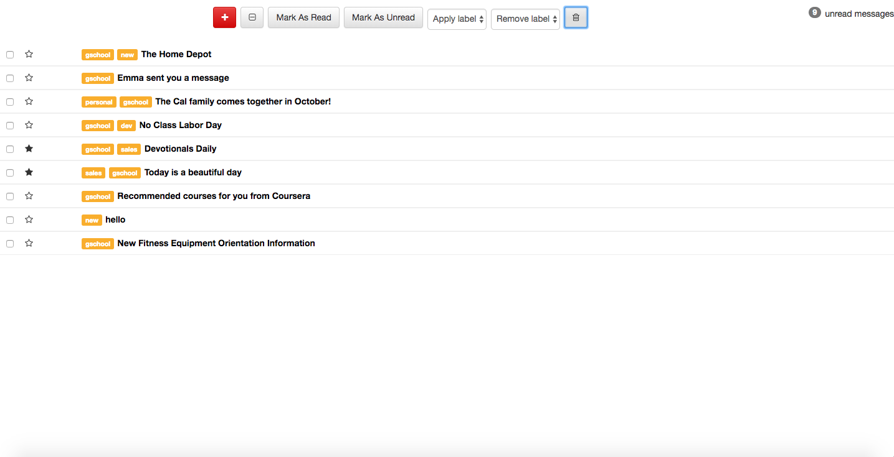
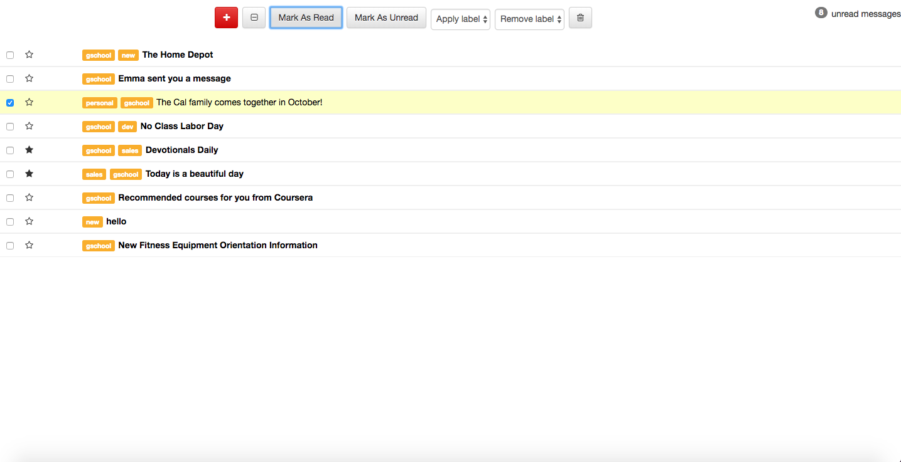
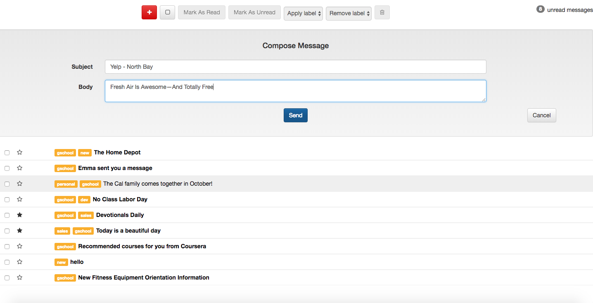
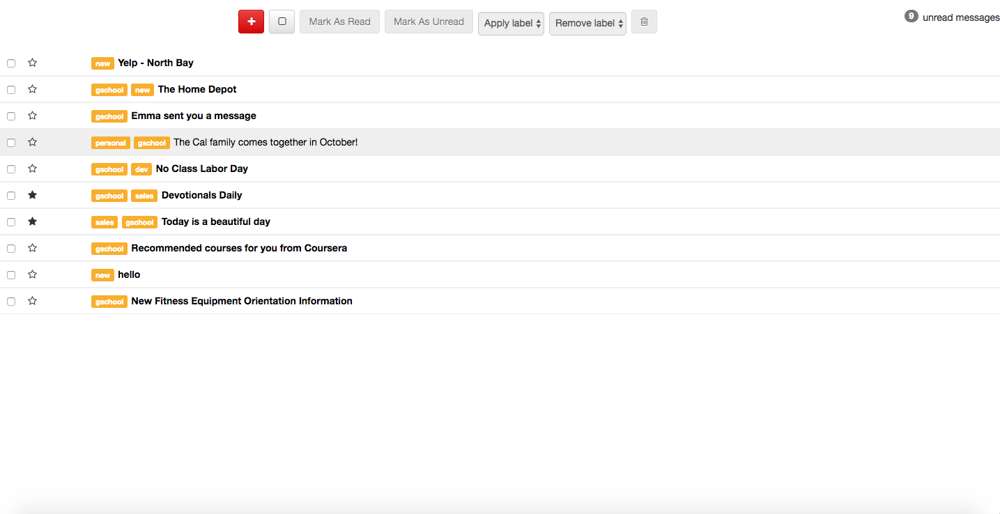
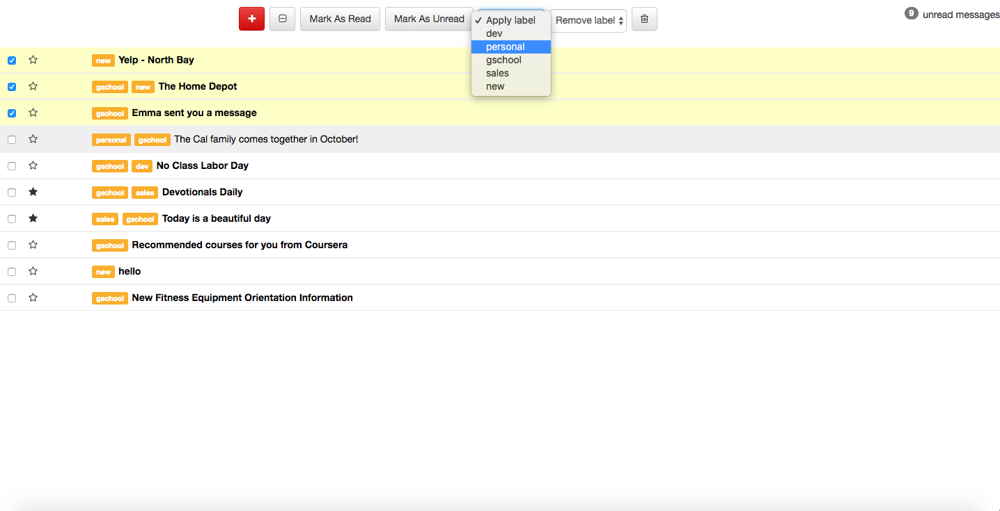
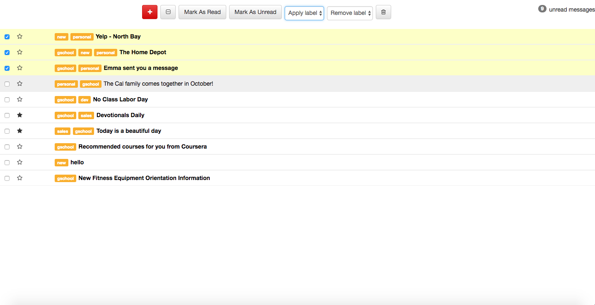
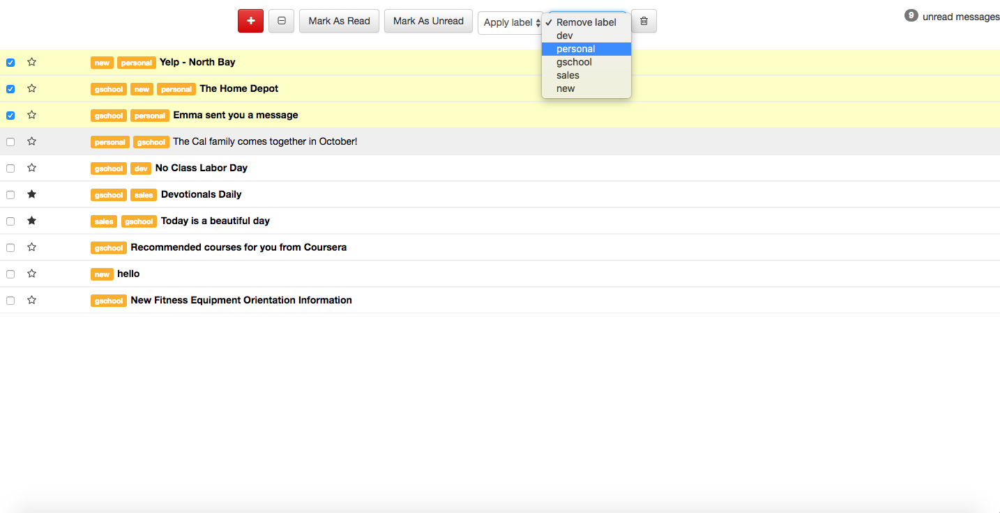
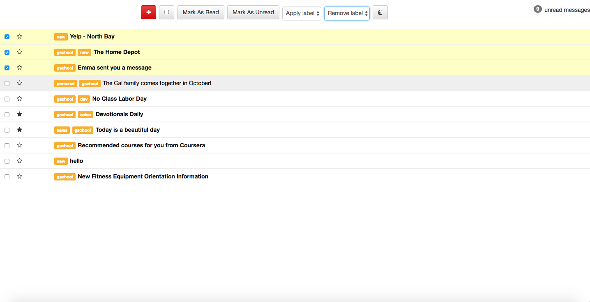
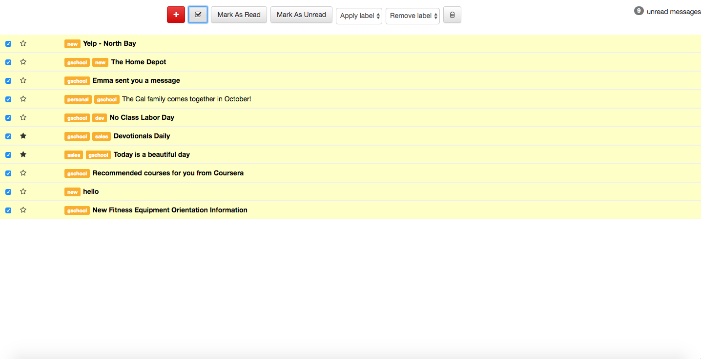
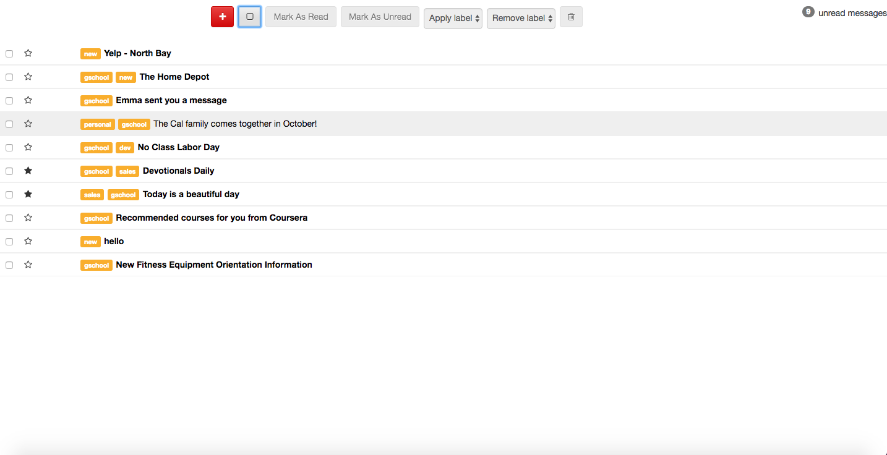

# React Galvanize Inbox

Created: Aug 2017 – Sep 2017

**Summary:**

Created an inbox UI for a fictitious Web-based email client. This application allows the user to
- select/deselect messages
- mark messages as read/unread
- star/unstar messages
- add/remove labels on messages
- delete messages
- create new messages

HTTP requests to Airtable API were made to synchronize the CRUD operations.   

**Technologies:**

Frontend:JavaScript ES6, HTML, Materialize CSS, Bootstrap, JSX, Storybook, React, Redux

Backend: HTTP, Airtable

Testing: Jest, Enzyme   

## Inbox UI

9 unread messages total.

   

## Select Message and Mark it as Read

8 unread messages remaining.

   

## Compose New Message

Click the red button to compose new message.

   

New message (Yelp - North Bay) successfully added to the list.

   

## Select Messages and Apply Label

Select three messages and click on the 'Apply label' dropdown menu.

   

The label 'personal' was successfully applied to those three selected messages.

   

## Select Messages and Remove Label

Click on the 'Remove label' dropdown menu and pick 'personal' again.

   

The label 'personal' was successfully removed from those three selected messages.

   

## Select and Deselect All Messages

Click the 'select all' button (second from the left) to select all messages.

   

Click the same button to deselect all messages.  Notice the square is now empty.

   
